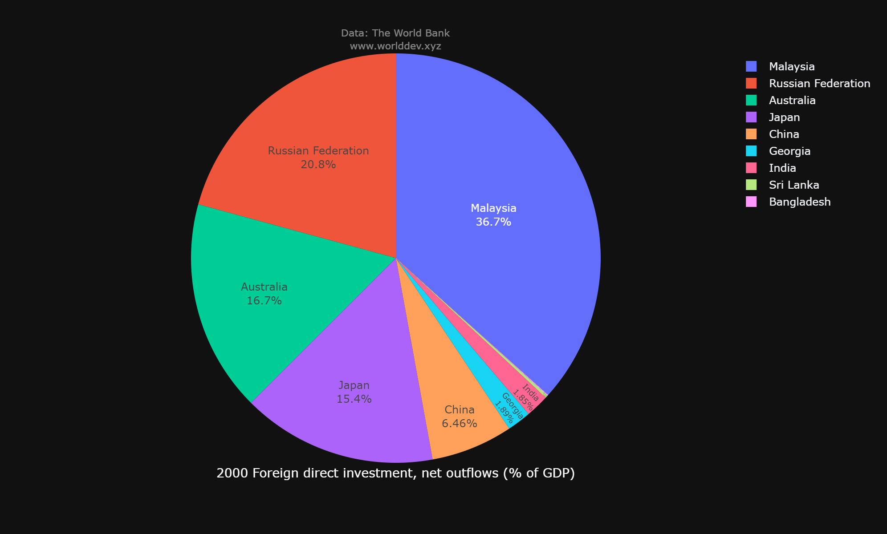
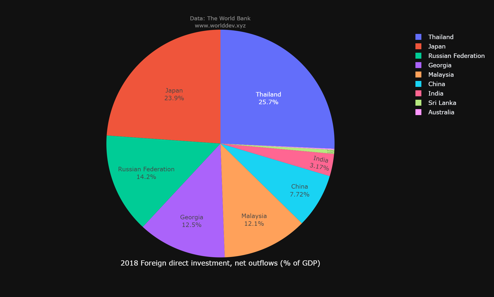
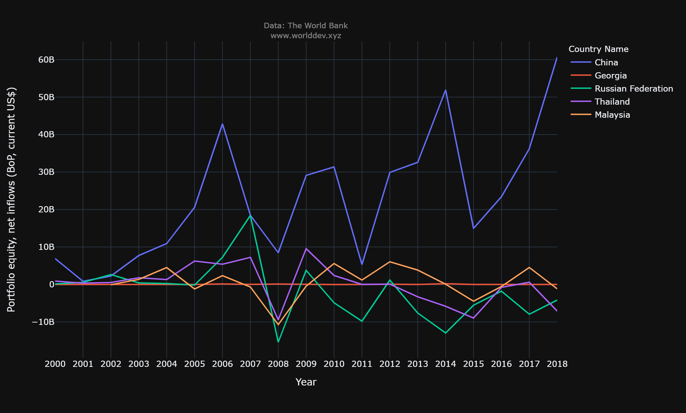
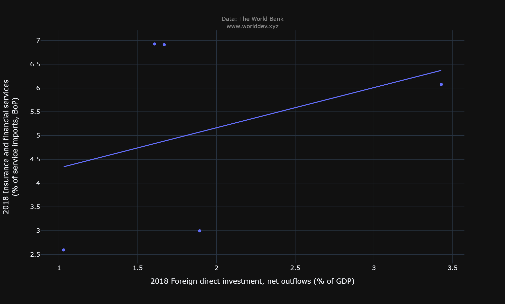
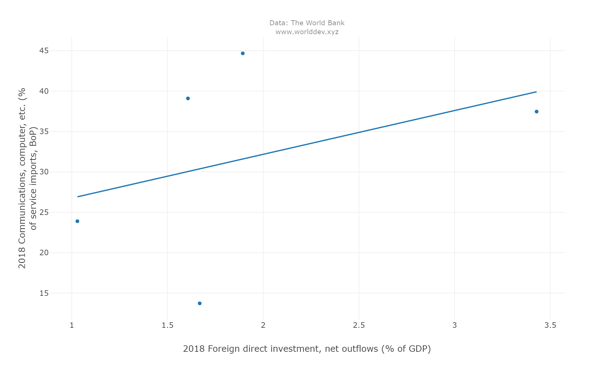
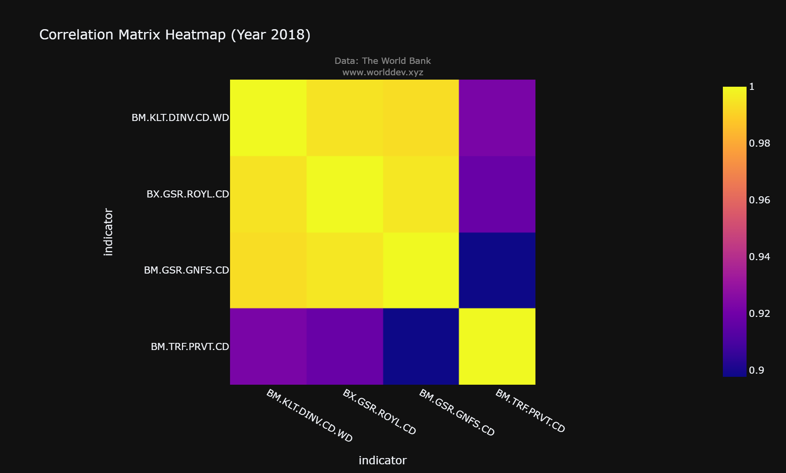

# Finacial Sector and its impact on Economy&Growth and Social Development

Finacial sector plays a cruial role on economy of a country and it also helps us to measure how much social development does a country has grown through that period. Direct investments from foreign countries increases the GDP which will help the nation to attain a stable economy. All the developed contries suchs as USA, England, Australia have a good finacial sector and that helped them have a steady economy and growth, we witnessed this in the pandemic itself. A country value depends upon its stock market and economy, understading how econmy helps the nation and its people is very important. By studying the economy and finacial sector one would gain knowledge how money is traded and this will help them personally to be successful in their personal life.

### What questions do you have in mind and would like to answer?
 
 what various factors are responsible for an increment or decrement of a econmy and how finacial sector works, I would like to find answer for these questions.

* Countries: Malaysia, Georgia, Russian Federation, China, Thailand

* Time Period : 2000 - 2018

The below pie charts indicates the direct investement of foriegn countries to the respective countries and what percent of their GPD consits of this foreign direct investments.
## In 2000

Malaysia had more than 36 pecent of foriegn direct investements that directly contributes their GDP in year 2000

Russian Federation had around 20.8 percent and the difference between Australia and Japan is ver minimal that they are almost equal. China, Georgia, Thailand, India, Sri Lanka had less than 10 percent in 2000. 

## In 2018 

By 2018 Thailand had nearly 25.7 percent of foriegn investements in their GDP, Japan Had almost 24 percent Russian Federation with 14.2 percent and Georgia 12.5 percent and Malaysia are almost equal. China, India, Sri Lanka and Australia had least foriegn investement. 

This tell us that over the course of 2 decades Thaliand had progressed so much and china had lost its investors. This indicates that the Thailand had increment in their GDP and possibly in other aspects also. We can also conculde that the countries with less foriegn investements had most probably had a stble income which made them require very less foriegn investements

Portfolio investments are the investments that are made on the stocks and debt securties diretly by the individuals in their respective nations, this tell us that debts that are also  made to invest in the bussiness.

The time series chart depicts how the portfolio investments are in these countries from 2000 to 2018 and what is their status. China had more portfolio investment till the year 2015 and had a steep decrement by the year 2018. Georgia residents had dosen't  invested in their stock markets from 2000 to 2018. Russian federation, Thailand and Malaysia had zig-zaw trend throughout the two decades and the investments that are made by the residents is less that 20 billion dollars by 2018. 

From observing the above chart we can conclude that among all the nations china had more portfolio investemnts from its residents, but at present have some unstability.

Any country can increse their GDP, by the foreign investements. The more the they foriegn investements the more they have the chance to develop the country and have a stable economy. There is also risk that, if the nation losses its foreign investors, the country losses its stability in economy and GDP.

The chart clearly shows that the china had the highest foriegn investements compare to any other country, all other countries are plummeted compare to china. Georgia had an investement of four billion dollars from foriegn and Russian ferderation,Malaysia, Thailand have negative index by 2018. This tell us that the retuns that are gained from China are huge and more foriegn investors are showing interest to have a share in the China stock market. This foriegn investments also lead to increase in employment also. For instance, if a forien investor sets a company in China this would create employment in that area which will be beneficial to its citizens. In this way a foriegn investment can make big difference in the the countries economy and growth.

If a non-resident invest money in a country not only he can be beneficial but also residents. If they set up a factory/firm/company they need a place to set it up and make sure they meet all the regulations shuch as insurance and many other things. These insurance are peovided by residents to non-residents which indirectly helping the country to bulid a economy on the insurance sector and also importing services such as communications, computer information and many other things.

In both the charts it is very clear that as the foriegn investements are increasing the GDP, it also indirectly paving a path to grow the bussiness which is helping to increase the economy.

Let us the see, how the correation between the investments that are made into the country and the various factors that helps to increase the economy of the country.

As the heatmap illustrates, the foriegn direct investments have a strong correlation with all the factors that are resbonsilbe for economy&growth. 

# Conclusion
There are various factors that can infulential the finacial sector and one among them is foriegn investements and these foriegn investements are also helping the nations to increase their economy and growth. From these interpretation we can say that they are dependent on each other and there are other factors also that can infulence the economy and growth of a nation.
