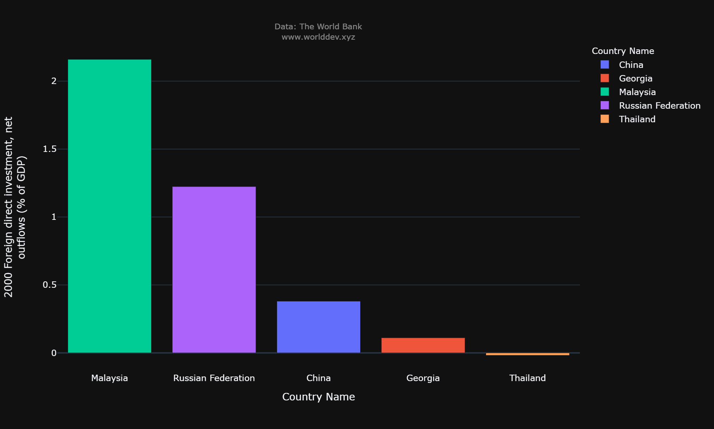
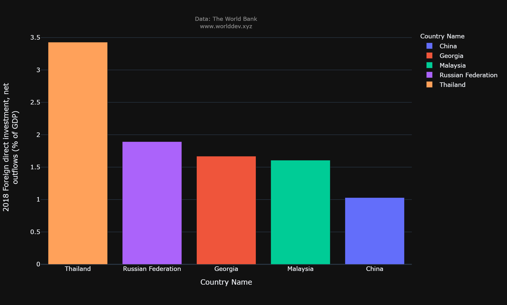

# Finacial Sector and its impact on Economy&Growth and Social Development

Finacial sector plays a cruial role on economy of a country and it also helps us to measure how much social development does a country has grown through that period. Direct investments from foreign countries increases the GDP which will help the nation to attain a stable economy.

* Countries: Malaysia, Georgia, Russian Federation, China, Thailand

* Time Period : 2000 - 2018

The below bar graph indicates the direct investement of foriegn countries to the respective countries and what percent of their GPD consits of this foreign direct investments.
## In 2000

Malaysia had more than 2 pecent of foriegn direct investements that directly contributes their GDP in year 2000

Russian Federation had around 1.2 percent and China, Georgia, Thailand had less than 0.5 percent in 2000.

## In 2018 

By 2018 Thailand had nearly 3.5 percent of foriegn investements in their GDP, Russian Federation with 1.8 percent and Georgia and Malaysia are almost equal. China had least foriegn investement. 

This tell us that over the course of 2 decades Thaliand had progressed so much and china had lost its investors. This indicates that the Thailand had increment in their GDP and possibly in other aspects also.

Portfolio investments are the investments that are made on the stocks and debt securties by the individuals on the respective nations, this also tells us that on which countries had highest investments over the course of period.

The time series chart depicts how the portfolio investments are in these countries from 2000 to 2018 and what is their status. China had more portfolio investment till the year 2015 and had a steep decrement by the year 2018. Georgia had dosrn't gained or loss any investements from 2000 to 2018. Russian federation, Thailand and Malaysia had zig-zaw trend throughout the two decades. 

From observing the above chart we can conclude that among all the nations china had more portfolio investemnts, but at present have some unstability.

